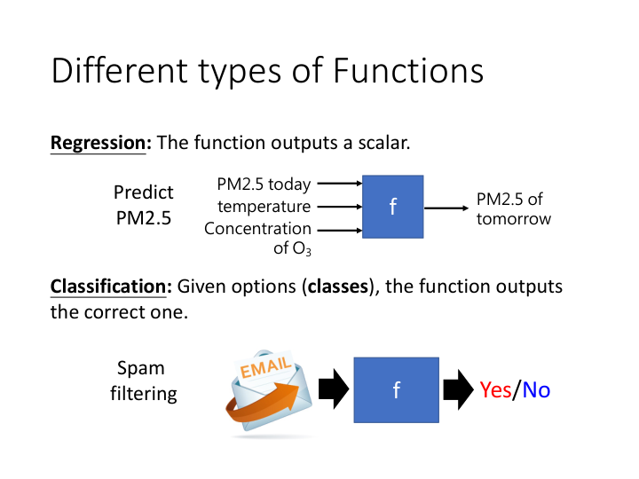
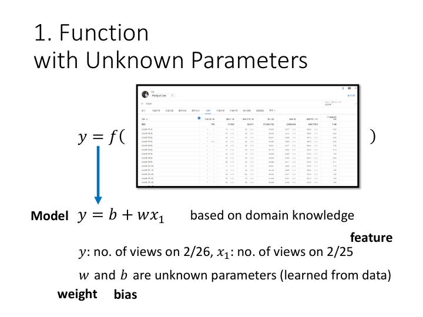
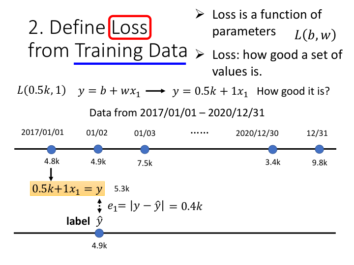
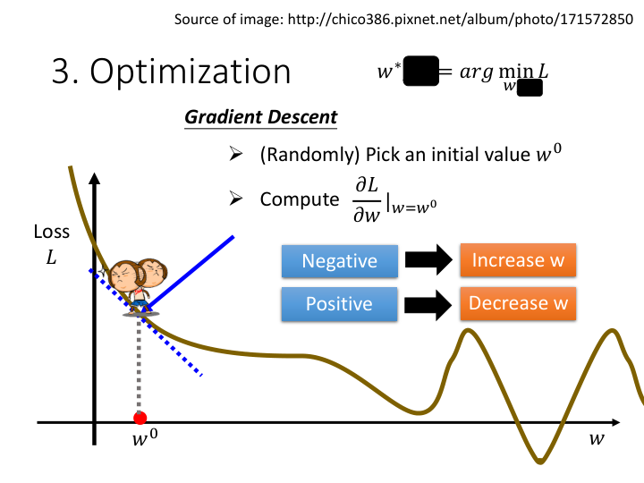
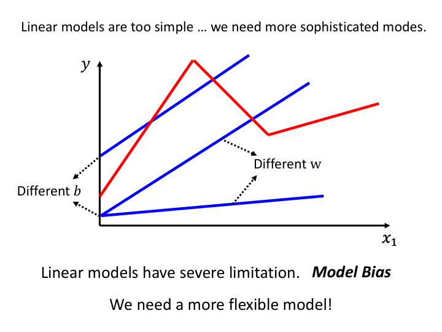
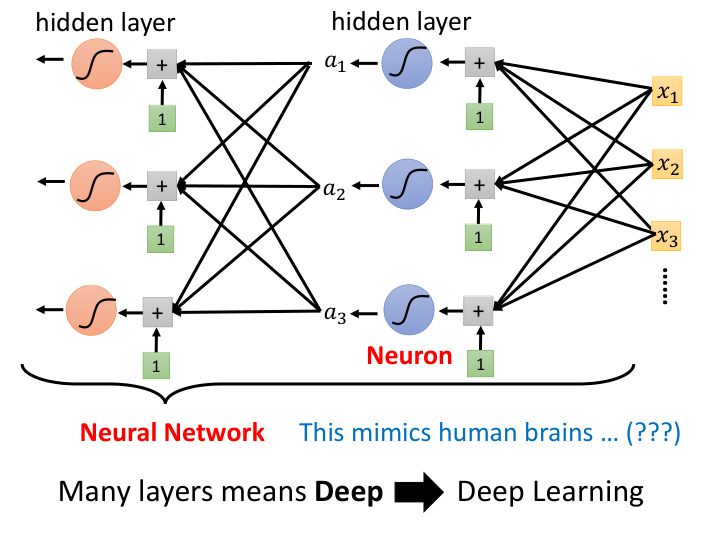

# 机器学习与深度学习入门学习报告

**课程来源：** 李宏毅 (Hung-yi Lee) - Introduction of Machine / Deep Learning 
**参考资料：** 课程视频及配套课件 `regression (v16).pdf`

---

## 1. 机器学习的核心概念

机器学习的本质可以概括为一句话：**“寻找一个函数 (Looking for Function)”**。

通过提供大量的历史数据，让机器自动寻找出一种输入到输出的映射关系（即函数）。常见的应用包括：
*   **语音识别 (Speech Recognition):** 输入一段音频，输出对应的文字。
*   **图像识别 (Image Recognition):** 输入一张图片，输出图片中的物体类别（如“猫”）。
*   **下围棋 (Playing Go):** 输入当前棋盘的落子情况，输出下一步最优的走法。

### 函数的不同类型：

*   **回归 (Regression):** 函数的输出是一个连续的数值（标量 scalar）。例如：预测明天的 PM2.5 浓度。
*   **分类 (Classification):** 给定几个选项（类别 classes），函数输出最正确的那一个类别。例如：垃圾邮件过滤（是/否）、下围棋（棋盘上19x19的落子位置分类）。
*   **结构化学习 (Structured Learning):** 输出具有结构的数据（如一张完整的图片、一篇文章）。

---

## 2. 案例分析：预测 YouTube 频道观看人数

为了直观地理解机器学习的运作流程，课程通过一个具体的回归任务——预测特定频道（如李宏毅老师的频道）隔天的总观看人数，详细拆解了机器学习的 **三大步骤 (3 Steps)**。

### Step 1: 定义带有未知参数的函数 (Function with Unknown Parameters)

首先，我们需要基于领域知识 (Domain Knowledge) 提出一个基础模型 (Model)。
*   **最简单的线性模型 (Linear Model):** $y = b + w \cdot x_1$
*   这里，$x_1$ 是前一天的观看人数，称为 **特征 (Feature)**。
*   $w$ (Weight 权重) 和 $b$ (Bias 偏差) 是未知的参数，需要机器通过数据“学”出来。

### Step 2: 定义损失函数 (Define Loss from Training Data)

为了知道模型中参数 $(w, b)$ 设置得好不好，需要定义**损失 (Loss, $L$)**。
*   Loss 也是一个函数，输入是模型的参数 $w, b$，即 $L(b, w)$。
*   使用历史的真实数据（训练数据 Training Data）来计算预测值 $\hat{y}$ 与真实标签 $y$ 之间的误差 $e$。
*   常见的误差计算方式：
    *   **MAE (Mean Absolute Error):** 平均绝对误差，$e = |y - \hat{y}|$
    *   **MSE (Mean Square Error):** 均方误差，$e = (y - \hat{y})^2$
*   将所有数据的误差平均起来，损失 $L$ 越小，说明这组参数越好。

### Step 3: 优化 (Optimization)

找到一组最优的参数 $w^*, b^*$ 使得损失函数 $L$ 最小化：$w^*, b^* = \arg\min_{w,b} L$。
采用的核心方法是 **梯度下降法 (Gradient Descent)**：
1.  随机挑选一个初始值 $w^0, b^0$。
2.  计算损失函数对参数的微分（即梯度）。如果微分为负，就增加 $w$；如果微分为正，就减小 $w$。
3.  更新参数：$w^1 \leftarrow w^0 - \eta \frac{\partial L}{\partial w}|_{w=w^0}$。
    *   这里的 $\eta$ 称为 **学习率 (Learning rate)**，是人为设定的参数，在机器学习中称为 **超参数 (Hyperparameter)**。
4.  不断迭代更新，直到找到损失极小的位置。
*(注：课程提到虽然存在局部最优 (Local minima) 的问题，但在实际深度学习中往往不是最大的阻碍。)*

---

## 3. 模型升级：从线性模型到深度学习

### 线性模型的局限性 (Model Bias)

最开始的线性模型太简单了，无论怎么调整 $w$ 和 $b$，它永远是一条直线。这就产生了一个限制，称为 **Model Bias**。

### 引入更复杂的非线性函数
为了拟合复杂的折线甚至连续的曲线，我们需要使用更灵活的模型。
任何一条连续的曲线，都可以用多个“常量 + 阶跃函数”组合逼近。为了让数学上更平滑，我们引入了 **Sigmoid 函数** 或更常用的 **ReLU (Rectified Linear Unit) 激活函数**。

*   **Sigmoid 函数:** $y = c \cdot \frac{1}{1 + e^{-(b + w x)}}$ (S型曲线，可调节斜率、水平平移和高度)
*   **ReLU 函数:** $y = c \cdot \max(0, b + w x)$ (修正线性单元)

### 构建神经网络 (Neural Network)

将输入的特征（过去几天的播放量）与多组参数相乘并相加，然后通过 Sigmoid 或 ReLU 函数激活，得到一个新的特征表示，这称为一层**隐藏层 (Hidden Layer)**。
在这个网络中：
*   复杂的参数矩阵记为 $W$，偏置向量记为 $b$。
*   每一个计算节点，为了让名字听起来更酷 (Fancy)，我们称之为 **神经元 (Neuron)**。
*   多层这样的网络堆叠起来，就构成了 **神经网络 (Neural Network)**。

### 什么是“深度”学习 (Deep Learning)?
当神经网络的隐藏层数量变得很多时，这个网络就变“深 (Deep)”了，这就是 **Deep Learning** 名称的由来。
*   随着层数增加（例如从1层增加到3层、4层），模型拟合训练数据的能力越来越强，训练误差会不断降低。
*   **过拟合 (Overfitting):** 当模型过于复杂（层数太深）时，可能在训练数据上表现非常好，但在未见过的测试数据（如2021年的数据）上表现反而变差。这在后续的课程中将会讨论如何解决。

---

## 总结
机器学习的核心框架可以归纳为三步走：
1. **写出一个带有未知参数的函数 $y = f_{\theta}(x)$**（Model设计，包含特征工程和网络结构）
2. **定义 Loss 函数 $L(\theta)$**（衡量参数好坏的标准）
3. **使用优化算法（如梯度下降）寻找最优参数 $\theta^*$**

现代深度学习本质上就是构建了一个包含多层激活函数（如 ReLU）极其复杂的非线性函数，并通过海量数据和算力完成 Optimization 的过程。